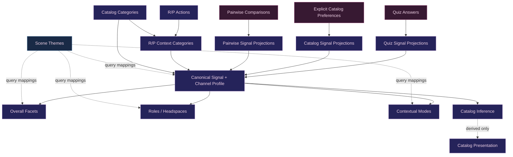

# Semantic Data Model

This document is the relationship map for the profile's current semantic layers.

## Core invariant

> Meaningful authored primitives should resolve through canonical **Signal + channel** references whenever that relationship is semantically honest, and derived layers must never feed themselves back into user evidence.

The semantic hierarchy is intentionally layered:

```text
independent user evidence
        ↓
canonical Signal + channel profile
        ↓
composed / descriptive semantic views
```

The code remains authoritative for exact IDs, mappings, and formulas.

## Relationship map



## Independent evidence

The canonical profile currently accepts three classes of independent evidence:

- quiz answers projected through authored question weights;
- explicit catalog preference projected through catalog mappings;
- This-or-That pairwise comparison evidence projected through catalog mappings.

These are independent because they represent something the user actually answered, selected, or compared.

Derived outputs — inferred catalog affinity, resolved catalog presentation, Overall Facets, roles/headspaces, contextual modes, scene candidate fit — are **not** new observations and must not feed back into canonical evidence.

See [Source-Aware Profile Evidence Architecture](profile-evidence-architecture.md).

## Canonical Signals

Canonical Signals are the reusable semantic concepts at the center of the profile.

The current runtime vocabulary and supported channels live in `src/data/canonicalSignals.ts`.

A Signal is referenced as:

```ts
{
  signalId: CanonicalSignalId,
  channel?: "overall" | "receiving" | "giving"
}
```

The Signal identifies the concept. The optional channel identifies a supported perspective on that concept.

Examples:

```text
Pain · Overall
Pain · Receiving
Pain · Giving

Care · Overall
Care · Receiving
Care · Giving

Role Embodiment · Overall
```

Not every Signal is directional. Unsupported channels must not be invented for symmetry.

See [Signal + Channel Data Model](data-model/signal-channel-model.md).

## Channel semantics

Receiving/Giving channels do **not** encode Dominant/submissive authority.

They answer which perspective of the semantic concept the evidence describes. Authority and activity side remain orthogonal.

Therefore:

- giving pain does not create Dominant evidence;
- receiving restraint does not create submissive evidence;
- giving service does not identify an authority position;
- receiving care does not identify an authority position.

See [Authority, Activity Side & Role Semantics](authority-activity-role-separation.md).

## Legacy directional IDs

Older source definitions still contain IDs that encoded direction directly in the Signal name.

Those IDs are compatibility input only. The canonical profile normalizes them into Signal + channel references before aggregation.

Example conceptual migration:

```text
legacy: care_giving
        ↓
canonical: Care · Giving
```

New semantic authoring should use canonical Signal + channel rather than adding another directional Signal ID.

The compatibility layer may remain as long as old stored/source data depends on it, but downstream profile semantics should not treat legacy IDs as a second canonical vocabulary.

## Overall Facets

Overall Facets are the nine broad, non-directional themes shown in the Overall Profile.

Current facet IDs are defined in `src/data/overallFacets.ts`:

- Power Exchange
- Structure & Protocol
- Ownership & Belonging
- Service & Devotion
- Care & Nurture
- Play & Resistance
- Primal & Instinctive
- Restraint & Physical Control
- Intensity & Pain

A facet is composed from canonical Signal references with bounded weights.

A facet mapping can reference either the Signal's Overall result or, where intentionally useful, a supported directional channel. That does not make the facet itself directional.

### Supports / Neutral / Opposes

Each Signal/facet relationship is conceptually one of:

- **Supports** — stronger affinity for the Signal supports the theme;
- **Neutral** — the Signal does not meaningfully define the theme;
- **Opposes** — stronger affinity for the Signal works against the theme.

Runtime definitions are sparse. An omitted Signal/facet pair is Neutral.

Support/Oppose is the direction of a semantic relationship. It is not the same concept as Receiving/Giving channel.

## Facet scoring

Facet affinity and coverage are separate outputs.

For each configured component:

1. resolve the referenced canonical Signal + channel;
2. ignore it when no evidence exists;
3. scale its configured contribution by that Signal result's coverage;
4. combine known supporting evidence into facet affinity;
5. subtract any configured opposing contribution;
6. report coverage separately from affinity.

Unknown components do not contribute zero preference.

A facet may therefore have a strong affinity with partial coverage. That means the evidence observed so far points strongly toward the theme, while a smaller share of the configured semantic surface has been explored.

## Roles / Headspaces

Roles/headspaces are recognizable derived states composed from canonical Signals.

They are **not** aliases for Overall Facets and are not a second evidence layer.

Examples of distinctions that must remain intact:

- Pet is not automatically submissive;
- Prey is not automatically submissive;
- Predator is not automatically Dominant;
- Caregiver is not automatically Dominant.

A role/headspace definition may intentionally use directional Signal channels, but the resulting role/headspace remains a composed interpretation of canonical evidence.

Current normalized compositions live in `src/data/canonicalRoleCompositions.ts`.

## Contextual modes

Contextual/dynamic modes are also composed from canonical Signals.

They represent useful underlying patterns or lenses for downstream context. They are not another competing set of top-level profile dimensions.

They should remain subordinate to the canonical hierarchy:

```text
Signal + channel
    ↓
contextual mode
```

rather than becoming a parallel source of evidence.

Current refinement of role/headspace and contextual-mode naming/usefulness is tracked in GitHub Issue #118 rather than in a repo planning document.

## Catalog semantics

A kink catalog item has stable item identity and category/source metadata. Its semantic meaning can map to one or more canonical Signals.

The catalog has multiple user-evidence channels that remain distinct:

```text
explicit preference
pairwise ranking
inferred affinity
```

Only the first two are independent user evidence. Inferred affinity is derived from the existing canonical profile and must not project back into it.

Catalog mapping applicability such as `receiving` / `giving` is not automatically identical to canonical Signal channel. Mapping code must resolve the intended semantic relationship explicitly.

## Rewards & Punishments semantics

Reward/Punishment suitability is its own contextual-use model.

R/P actions do not receive a second hand-authored Overall Facet truth.

The semantic route is:

```text
R/P Action
    ↓ weighted categories
R/P Context Category
    ↓ authored semantic bridge
Canonical Signal + channel
    ↓
Overall Facets / other derived views
```

The separate Catalog Category → R/P Context Category bridge answers a compatibility/suggestion question; it does not replace Catalog Category → Signal semantics.

Those routes intentionally answer different questions.

## Scene themes and query layers

Scene themes are query/composition metadata, not evidence.

A theme may map to Signals, Overall Facets, roles/headspaces, contextual modes, catalog categories, or R/P categories in order to find relevant candidates.

Selecting a theme does not alter the user's profile and must never create canonical Signal evidence.

## Affinity and coverage

Across derived profile layers, keep these concepts distinct:

- **affinity / match** — where the known evidence points;
- **coverage / evidence breadth** — how much relevant evidence supports that interpretation.

Unknown is not zero.

Do not globally cap a strong affinity merely because coverage is partial. Coverage should influence confidence, effective evidence weight, visibility thresholds, and explanatory language rather than masquerading as weaker preference.

## Curation

The Curation Workbench reviews the authored definitions and mappings that create this semantic graph.

It must keep separate:

- canonical Signal channel;
- Signal → Facet Supports/Neutral/Opposes relationship;
- catalog mapping applicability;
- authority context;
- roles/headspaces;
- user preference evidence.

See [Curation Workbench](product/curation-workbench.md).

Active taxonomy calibration, mapping gaps, redundancy review, and semantic refinement are tracked in GitHub Issues #118 and #121. Repo documentation should describe the contract that currently exists rather than duplicate those work checklists.

## Invariants

1. Independent user evidence is stored/preserved by source.
2. Canonical Signals normalize semantic meaning before cross-source profile aggregation.
3. Signal identity is separate from optional Receiving/Giving channel.
4. Receiving/Giving channel is separate from Dominant/submissive authority.
5. Overall Facets are broad non-directional themes, not evidence sources.
6. Roles/headspaces and contextual modes are derived compositions, not evidence sources.
7. Inferred catalog affinity never feeds back into Signals.
8. Scene/query selection never feeds back into Signals.
9. Unknown evidence is not zero preference.
10. Affinity and coverage remain distinct.
11. Stable IDs, not labels, are runtime identity.
12. When a mapping is not semantically honest, leave the gap visible and resolve it through curation rather than inventing a convenient weight.
