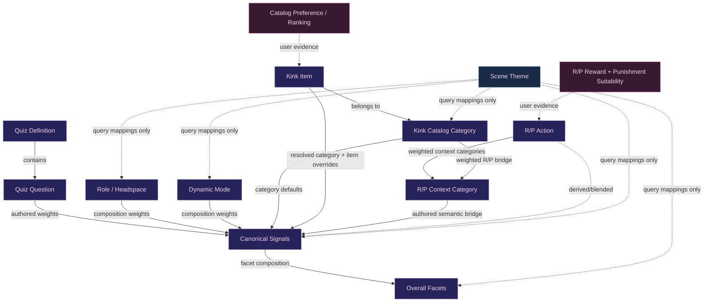

# Semantic Data Model

This document is the quick relationship map for the profile's authored semantic primitives.

## Core invariant

> Meaningful semantic primitives should have a deterministic route through canonical **SignalIds** into the shared **Overall Facet** space whenever that relationship is semantically honest.

Overall Facet affinity is **derived descriptive metadata**. It is not user preference evidence and must not feed back into quiz answers, rankings, catalog preferences, reward/punishment suitability, or other stored profile state.

Signal ↔ Overall Facet is **many-to-many**. Overall Facets are nine broad, non-directional **themes**. One Signal may relate to multiple themes and one theme may relate to many Signals.

Each Signal/theme pair is conceptually classified as:

- **Supports** — the Signal is positive evidence for the theme.
- **Neutral** — the Signal does not meaningfully define the theme.
- **Opposes** — stronger affinity for the Signal works against the theme.

Non-neutral relationships carry a 0–1 strength. The runtime facet definition is sparse: omitted pairs are Neutral. The Signal Workbench renders all nine themes so the full matrix can be reviewed without creating a second source of truth.

If a primitive cannot honestly resolve into Overall Facets, keep the gap visible for M16 review rather than inventing a mapping.

## Relationship map



## R/P category bridge

R/P actions do **not** receive hand-authored Overall Facet weights.

Instead:

```text
R/P Action
    ↓ weighted
R/P Context Category
    ↓ authored
SignalIds
    ↓ derived
Overall Facets
```

This keeps one semantic source of truth.

The existing Catalog Category → R/P Context Category mapping remains a separate compatibility/suggestion bridge:

```text
Kink Item → Catalog Category
                    │
                    ├──→ SignalIds → Overall Facets
                    │
                    └──→ R/P Context Categories → SignalIds → Overall Facets
```

Those two routes answer different questions:

- Catalog Category → Signals describes what the kink category **means**.
- Catalog Category → R/P Context describes which reward/punishment **experience buckets resemble it**.

## Granularity and channel semantics

**Detailed contract:** [M16 Signal + Channel Model](m16-signal-channel-model.md)  
**Current 45-Signal audit:** [M16 Signal Channel Audit](m16-signal-channel-audit.md)

Overall Facets intentionally **do not** have giving/receiving or Dominant/submissive sides. They are thematic compression.

M16 is normalizing activity-side semantics so that:

- **Signal = semantic concept**
- **channel = overall / receiving / giving perspective**
- Overall evidence never invents a directional preference
- directional evidence may roll upward into the broader Overall concept
- downstream definitions reference Signal + optional channel
- not every Signal requires Receiving/Giving channels

Examples:

```text
Control
  Overall
  Receiving
  Giving

Care
  Overall
  Receiving
  Giving

Role Embodiment
  Overall only
```

This replaces the long-term model of encoding activity side directly into IDs such as `care_giving` and `care_receiving`.

The migration is not complete yet; existing runtime IDs remain valid until the channel migration is implemented.

Giving-side activity must never be inferred as Dominant identity, and receiving-side activity must never be inferred as submissive identity.

## Current M16 coverage gaps

The semantic bridge deliberately exposes incomplete coverage instead of hiding it.

At the start of M16.7:

- 45 canonical SignalIds exist.
- `role_embodiment`, `younger_headspace`, and `anticipation` currently have no non-neutral authored theme relationship. They remain Signal-matrix review targets rather than generic "facet gaps".
- 17 of 35 kink catalog categories currently have authored category-level Signal mappings; 18 do not.
- R/P `Sexual / Scene` currently has no honest Signal mapping in the existing vocabulary.

These are **review targets**, not invitations to invent arbitrary weights. M16.4/M16.7 should decide whether each gap means:

1. a mapping is genuinely missing,
2. the Overall Facet vocabulary is missing a meaningful dimension,
3. the primitive is organizational/context-only rather than semantic, or
4. the primitive itself should be revised/removed.
