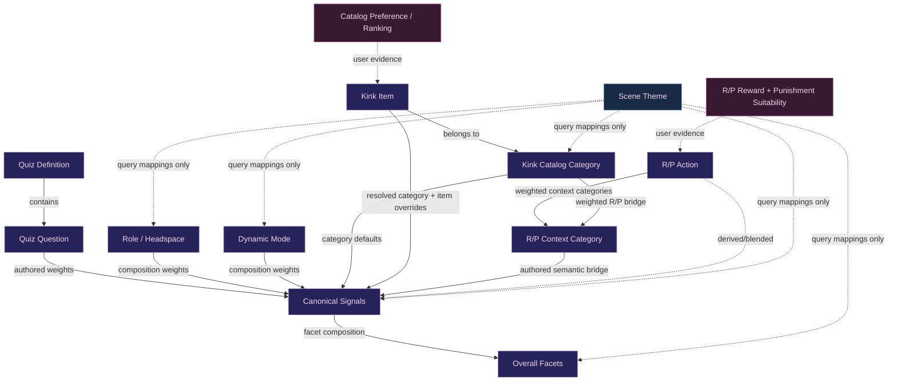

# Semantic Data Model

This document is the quick relationship map for the profile's authored semantic primitives.

## Core invariant

> Meaningful semantic primitives should have a deterministic route through canonical **SignalIds** into the shared **Overall Facet** space whenever that relationship is semantically honest.

Overall Facet affinity is **derived descriptive metadata**. It is not user preference evidence and must not feed back into quiz answers, rankings, catalog preferences, reward/punishment suitability, or other stored profile state.

If a primitive cannot honestly resolve into Overall Facets, keep the gap visible for M16 review rather than inventing a mapping.

## Relationship map



## R/P category bridge

R/P actions do **not** receive hand-authored Overall Facet weights.

Instead:

```text
R/P Action
    ↓ weighted
R/P Context Category
    ↓ authored
SignalIds
    ↓ derived
Overall Facets
```

This keeps one semantic source of truth.

The existing Catalog Category → R/P Context Category mapping remains a separate compatibility/suggestion bridge:

```text
Kink Item → Catalog Category
                    │
                    ├──→ SignalIds → Overall Facets
                    │
                    └──→ R/P Context Categories → SignalIds → Overall Facets
```

Those two routes answer different questions:

- Catalog Category → Signals describes what the kink category **means**.
- Catalog Category → R/P Context describes which reward/punishment **experience buckets resemble it**.

## Direction semantics

Giving/receiving is activity side, not authority identity.

A SignalId such as `receiving_restraint` or a category mapping with `Applies To = receiving` must never be interpreted as submissive. Likewise, giving-side activity does not imply Dominant identity.

## Current M16 coverage gaps

The semantic bridge deliberately exposes incomplete coverage instead of hiding it.

At the start of M16.7:

- 45 canonical SignalIds exist; 42 are currently referenced by at least one Overall Facet.
- `role_embodiment`, `younger_headspace`, and `anticipation` currently have no Overall Facet route.
- 17 of 35 kink catalog categories currently have authored category-level Signal mappings; 18 do not.
- R/P `Sexual / Scene` currently has no honest Signal mapping in the existing vocabulary.

These are **review targets**, not invitations to invent arbitrary weights. M16.4/M16.7 should decide whether each gap means:

1. a mapping is genuinely missing,
2. the Overall Facet vocabulary is missing a meaningful dimension,
3. the primitive is organizational/context-only rather than semantic, or
4. the primitive itself should be revised/removed.
